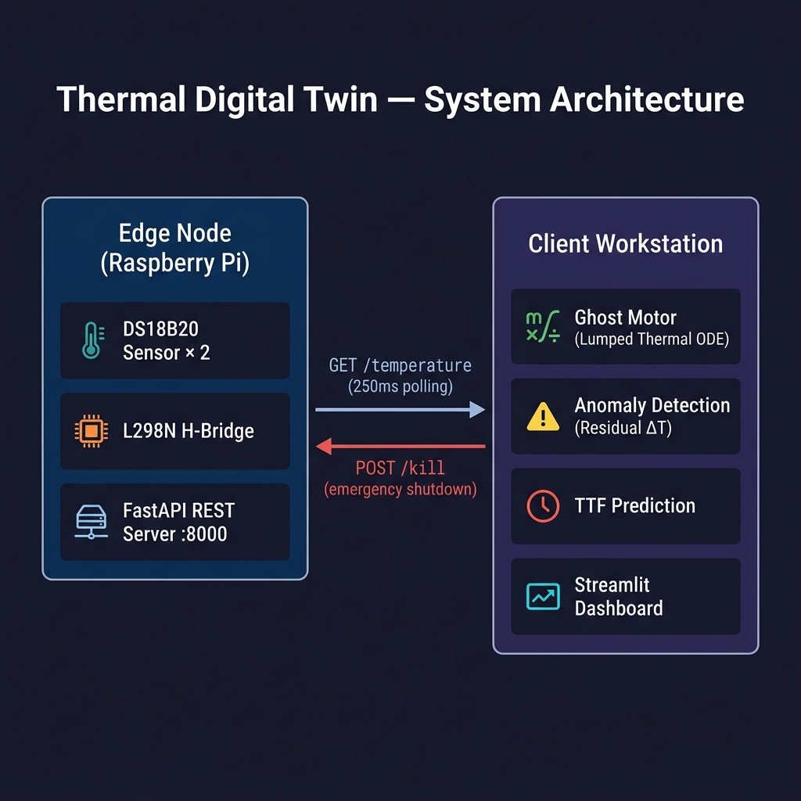
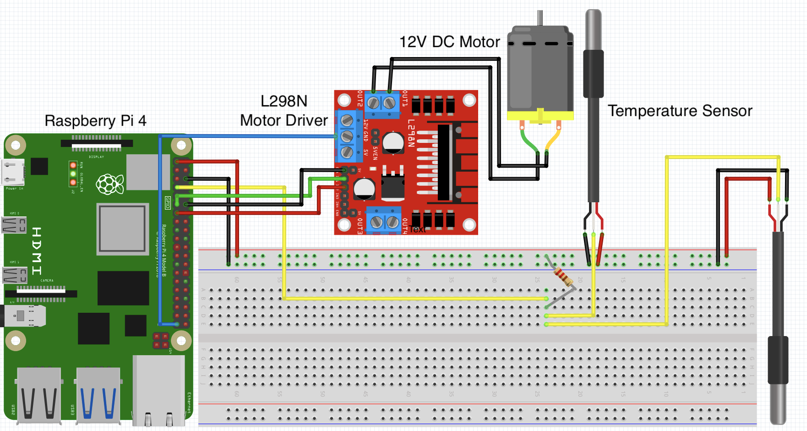

# Thermal Digital Twin — 12V DC Motor

A real-time predictive maintenance system that implements a **physics-based Lumped Thermal (Lumped Capacitance) Twin** for a 12V DC motor. The system continuously monitors motor surface temperature via on-device sensors on a Raspberry Pi edge node, synchronises a mathematical parallel model (the *Ghost Motor*) in real time, and autonomously engages a safety shutdown when failure is imminent — conforming to the **ISO 23247** Digital Twin standard for manufacturing.

---

## System Architecture



| Component | Role |
|---|---|
| `pi_server/` | Reads DS18B20 sensors via the 1-Wire kernel driver; exposes a FastAPI REST API; drives the L298N H-Bridge for motor control and emergency kill |
| `client/` | Runs the Streamlit dashboard; hosts the digital twin physics model; performs TTF calculation and anomaly detection; issues remote kill commands |

---

## Hardware Requirements



| Component | Details |
|---|---|
| Raspberry Pi | Any model with GPIO (tested on Raspberry Pi 4) |
| DC Motor | 12V brushed DC (e.g. `31ZY`, ~165 g steel housing) |
| Motor Driver | L298N H-Bridge |
| Temperature Sensors | 2× **DS18B20** 1-Wire sensors (motor surface + ambient) |
| Power Supply | 12V DC for motor; 5V USB for Raspberry Pi |
| Breadboard | For DS18B20 pull-up resistor circuit |
| Resistor | 4.7 kΩ pull-up between DS18B20 DQ and 3.3V |

### Raspberry Pi → L298N Motor Driver (GPIO BCM)

| Pi Pin | Signal | Wire Colour | L298N Pin |
|---|---|---|---|
| GPIO 18 | ENA — PWM speed control | Yellow | ENA |
| GPIO 17 | IN1 — direction control | Green | IN1 |
| GPIO 27 | IN2 — direction control | Red | IN2 |
| GND | Ground | Black | GND |

### DS18B20 Temperature Sensors → Breadboard → Raspberry Pi

Both sensors share the same 1-Wire data bus. The 4.7 kΩ pull-up resistor sits on the breadboard between the 3.3V rail and the DQ data line.

| DS18B20 Pin | Breadboard / Connection | Pi Pin | Wire Colour |
|---|---|---|---|
| VCC (right) | Breadboard 3.3V rail | 3.3V (Pin 1) | Red |
| GND (left) | Breadboard GND rail | GND (Pin 6) | Black |
| DQ / Data (middle) | Breadboard data row → 4.7 kΩ → 3.3V rail | GPIO 4 (Pin 7) | Yellow |

### 12V DC Motor → L298N Output

| Motor Terminal | L298N Pin | Wire Colour |
|---|---|---|
| Motor + | OUT1 | Green |
| Motor − | OUT2 | Yellow |

> **Note:** The L298N +12V and GND screw terminals must be connected to your external 12V power supply, **not** to the Raspberry Pi.

---

## Software Dependencies

Python 3.9+ is required on both the Pi and the client machine.

**Raspberry Pi server:**
```bash
pip install -r pi_server/pi_requirements.txt
```

**Client workstation (dashboard):**
```bash
pip install -r client/requirements.txt
```

Key libraries used:

| Library | Purpose |
|---|---|
| `fastapi` + `uvicorn` | REST API on the Raspberry Pi |
| `RPi.GPIO` | GPIO and PWM motor control |
| `streamlit` | Live monitoring dashboard |
| `altair` | Interactive temperature time-series charts |
| `numpy` | Euler integration of the thermal ODE |

---

## Installation & Setup

### Step 1 — Clone the repository

```bash
git clone git@github.com:Maximus01122/DigitalTwin.git
cd thermal_dt
```

### Step 2 — Hardware wiring

1. Connect both DS18B20 sensors to the Raspberry Pi's GPIO 4 (1-Wire bus) with a shared 4.7 kΩ pull-up resistor to 3.3V.
2. Connect the L298N H-Bridge ENA → GPIO 18, IN1 → GPIO 17, IN2 → GPIO 27.
3. Connect the 12V supply to the L298N motor power input and the motor terminals to the L298N output.
4. Find the **1-Wire device IDs** by running the following command on the Raspberry Pi:
   ```bash
   ls /sys/bus/w1/devices
   ```
   You will see entries like `28-25c40087f9ef` and `28-651c0087078f`. Copy these into `pi_server/server.py`:
   ```python
   SENSOR_AMBIENT = "28-xxxxxxxxxxxx"
   SENSOR_MOTOR   = "28-xxxxxxxxxxxx"
   ```

### Step 3 — Enable 1-Wire on the Raspberry Pi

Add the following line to `/boot/config.txt` and reboot:
```
dtoverlay=w1-gpio
```

### Step 4 — Start the Pi server

```bash
# On the Raspberry Pi
pip install -r pi_server/pi_requirements.txt
uvicorn pi_server.server:app --host 0.0.0.0 --port 8000
```

Verify it is running by visiting `http://<pi-ip>:8000/health` from any machine on the network.

### Step 5 — Start the client dashboard

```bash
# On your workstation
pip install -r client/requirements.txt
cd client
streamlit run app.py
```

> **Note:** The dashboard connects to `http://raspberrypi.local:8000` by default. If your Pi uses a different hostname or IP address, update `PI_URL` at the top of `client/app.py`.

---

## Usage

Once both sides are running, open the Streamlit dashboard in your browser (default: `http://localhost:8501`).

### Live Metrics Panel

| Metric | Description |
|---|---|
| **Ambient Temp** | DS18B20 reading of the ambient environment (°C) |
| **Surface Temp** | DS18B20 reading of the motor casing surface (°C) |
| **Ghost Twin** | Physics model estimate of what the temperature *should be* (°C) |
| **Residual** | `Surface − Ghost Twin` — unexplained excess heat, indicating an anomaly |
| **Predictive TTF** | Estimated time (seconds) until surface temperature reaches the thermal limit |

### Safety Thresholds

- **Max safe temperature:** 35 °C
- **TTF warning:** < 600 s (yellow)
- **TTF critical / auto-kill:** < 300 s (red, kill switch auto-engages)
- **Anomaly alert:** Residual ≥ 3.0 °C (likely stall, short circuit, or increased mechanical resistance)

### Manual Controls

| Button | Action |
|---|---|
| 🟢 POWER MOTOR ON | Deactivates the kill switch; motor spins at 100% PWM duty cycle |
| 🚨 ENGAGE EMERGENCY KILL | Immediately cuts motor power via the L298N |

### Automatic Kill Switch

The system will **automatically** send a `POST /kill` command to the Raspberry Pi and shut down the motor when either of the following conditions is true:
- Surface temperature ≥ 35 °C, **or**
- Predicted TTF < 300 seconds

A toast notification is displayed in the dashboard when this occurs.

---

## Physics Model

### Lumped Capacitance (Lumped Thermal) Model

The Digital Twin integrates the following first-order ODE (the *lumped capacitance* assumption) in real time:

$$m \cdot c_p \frac{dT}{dt} = \dot{Q}_{in} - h_{eff} \cdot A_s \cdot (T - T_{amb})$$

| Symbol | Meaning | Value |
|---|---|---|
| $m$ | Motor mass | 0.165 kg |
| $c_p$ | Specific heat capacity (steel) | 460 J/(kg·K) |
| $T$ | Motor surface temperature | — |
| $T_{amb}$ | Ambient temperature | live sensor reading |
| $\dot{Q}_{in}$ | Effective waste heat input | 0.366 W |
| $h_{eff}$ | Effective heat transfer coefficient | 2.263 W/(m²·K) |
| $A_s$ | Effective surface area | 0.05 m² |

### Calibrated Parameters

The parameters $h_{eff}$, $\dot{Q}_{in}$, and the thermal time constant $\tau = 671\,\text{s}$ were fitted from four physical data collection runs (`run_A.csv` – `run_D.csv`) using a joint regression against the measured temperature curves. The `plot_compare.py` script visualises the model vs. measured data.

### Ghost Motor (Parallel Digital Twin)

The *Ghost Motor* is a software-only instance of the same thermal model running at every dashboard refresh (250 ms). It tracks what the motor temperature *should be* under normal operating conditions. When `kill_active` is set, the heat input $\dot{Q}_{in}$ is zeroed to mirror the physical shutdown.

**Anomaly Detection** — the residual $\Delta T = T_{surface} - T_{ghost}$ captures unexplained excess heat. A sustained residual ≥ 3 °C triggers an alert.

### Time-to-Failure (TTF)

TTF is estimated by a linear regression over the 20 most recent temperature readings to compute the current rate of change $\frac{dT}{dt}$, then projecting to the thermal limit:

$$TTF = \frac{T_{max} - T_{current}}{\frac{dT}{dt}}$$

---

## Repository Structure

```
thermal_dt/
├── client/
│   ├── app.py              # Streamlit dashboard + real-time polling loop
│   ├── thermal_model.py    # ThermalDigitalTwin class (Ghost Motor + TTF + anomaly)
│   ├── derive.py           # Offline parameter derivation utilities
│   └── requirements.txt    # Client-side Python dependencies
│
├── pi_server/
│   ├── server.py           # FastAPI edge server (sensor reads + motor control)
│   ├── temp_collection.py  # Standalone data logging script (for calibration runs)
│   └── pi_requirements.txt # Raspberry Pi Python dependencies
│
├── plot_compare.py         # Offline model-vs-measured visualisation script
├── run_A.csv               # Calibration run A 
├── run_B.csv               # Calibration run B
├── run_C.csv               # Calibration run C
├── run_D.csv               # Calibration run D
├── run_off.csv             # motor-off baseline run
└── README.md               
```

---

## ISO 23247 Compliance

This project follows the **ISO 23247 Digital Twin framework for manufacturing**:

| ISO 23247 Entity | Implementation |
|---|---|
| **Physical Twin** | 12V DC motor with DS18B20 sensors and L298N H-Bridge |
| **Digital Twin** | `ThermalDigitalTwin` class — physics-based lumped model |
| **Synchronisation** | Real-time REST API polling at 250 ms intervals |
| **Connection Layer** | FastAPI server over HTTP on LAN |
| **Services** | Predictive TTF, anomaly detection, automated safety shutdown |

---

## License

This project was developed as part of CAS 782: Engineering Digital Twins
